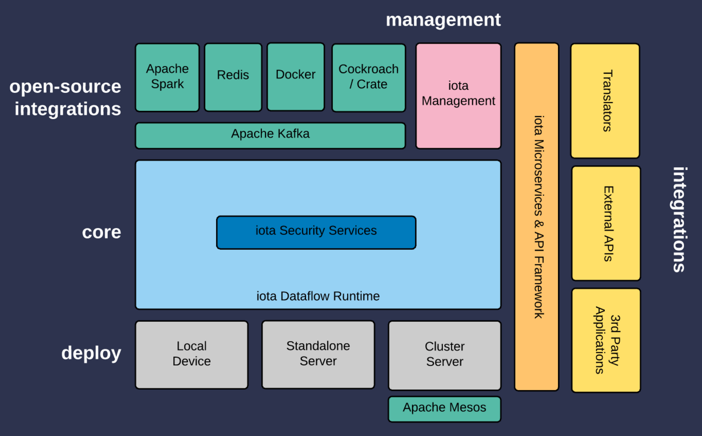

# iota

The iota open-source iot platform consists of a number of open source components including larger componets such a Kafka, Mesos and others. The core
iota components found in the folders in this code repository and they include:

1. The **Fey Engine** in the folder fey-core - This is written in Scala and uses the Akka framework
2. **Performers** these are the "third party" or user defined components found in the folder Performers
3. iota can be deployed across devices, standalone servers and clusters the Deployments folder is a set of helper scripts that can be used in deploying iota in these different contexts. 
4. iota management is a Django (python) based management system for iota whose code can be found in the management folder

## iota architecture

 
