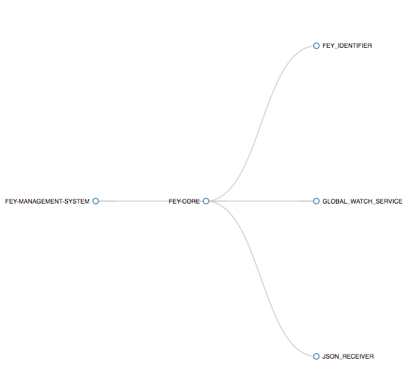
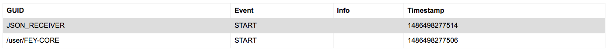

# iota

The iota open-source iot platform consists of a number of open source components including larger components such a Kafka, Mesos and others. The core
iota components found in the folders in this code repository and they include:

1. The **Fey Engine** in the folder fey-core - This is written in Scala and uses the Akka framework
2. **Performers** these are the "third party" or user defined components found in the folder Performers
3. iota can be deployed across devices, standalone servers and clusters the Deployments folder is a set of helper scripts that can be used in deploying iota in these different contexts. 
4. iota management is a Django (python) based management system for iota whose code can be found in the management folder

## iota architecture

 
 
 
# Building and Running IOTA

Fey is a Scala framework developed using Akka Actors (<http://akka.io/>). If still don't know the Actor model offered by Akka, We suggested that you take sometime to look into it and get at least a basic idea of the Akka Actor model and concepts. The current version of Akka that is being used on Fey is `2.10.4`

In order to be able to build and run it you will need to install the following on your machine:

## Prerequisites

1. Java **SDK** (Software Development Kit) 1.8+
2. Scala 2.11.8
3. **SBT** 0.13.11 (<http://www.scala-sbt.org/>)

Once your environment is ready to go, you will need to download the source code:

## Source code

Choose the directory where you want to download the source code to. Lets call it **IOTA_SOURCE_DIR**.

The source code for IOTA is available at GitHub (<https://github.com/apache/incubator-iota>). Make sure you have **git** installed.

```shell
>> cd IOTA_SOURCE_DIR
>> git clone git@github.com:apache/incubator-iota.git

```

Once the **git clone** command has finished with success, you should see the source code for IOTA in the folder **incubator-iota**

### Code structure

IOTA project is composed by 3 main components: fey-core, performers and deployments.

1. **fey-core**: Contains the source code of the core component of IOTA, called **Fey**. We will be mainly talking about how to build and run the fey-core component
2. **performers**: Fey-core by itself does not do anything, it is only an Actor System. Performers are the actors of the system, and the actual action executed in the framework. This folder contain some performer examples.
3. **deployments**: TBD

We will be focused on the **fey-core** and **performers** components.

## Building fey-core

Fey core uses the SBT tool. In order to build the fey-core **.jar** go to your terminal and:

```shell
>> cd IOTA_SOURCE_DIR\incubator-iota
>> sbt 
>> project fey-core
>> assembly 

```

The command `assembly` will run all fey-core unit tests and build the **.jar**. If everything is executed successfuly you should see a message like:

```
[info] SHA-1: 5644d19b7ebc9dec87646e9327a4c163c62936d3
[info] Packaging IOTA_SOURCE_DIR/incubator-iota/fey-core/target/scala-2.11/iota-fey-core.jar ...
[info] Done packaging.
[success] Total time: 70 s, completed Feb 7, 2017 11:13:30 AM
```

Check at `IOTA_SOURCE_DIR/incubator-iota/fey-core/target/scala-2.11` for the **iota-fey-core.jar**

## Configuring Fey

Once you have built fey-core, you should configure it propertly.
Fey-core reads a **.conf** file. The default configuration can be find at ```IOTA_SOURCE_DIR/incubator-iota/fey-core\src\main\resources\application.conf```

The basic configuration you should worry about are the directories used by Fey. Fey core does not create the directories, therefore, the directories must be already created before starting Fey.

Let's create a basic configuration for fey.

1. Create a **my-fey.conf** file with the folllowing content:

```javascript
fey-global-configuration{

enable-checkpoint = true

checkpoint-directory = ${HOME}"/feyCheckpoint"

json-repository = ${HOME}"/feyJSONRepo"

json-extension = ".json"

jar-repository = ${HOME}"/feyJarRepo"

log-level = "INFO"
}

```

Create the directories that are going to be used by Fey: 

1. ${HOME}"/feyCheckpoint"
2. ${HOME}"/feyJSONRepo"
3. ${HOME}"/feyJarRepo"

## Running Fey

Once you have defined the my-fey.conf configuration file for fey, and created all the necessary directories you should be ready to run Fey.

```sh
>> java -jar IOTA_SOURCE_DIR/incubator-iota/fey-core/target/scala-2.11/iota-fey-core.jar PATH_TO/my-fey.conf
```

You should see an output like:


```
[INFO] [17/02/07 12:11:17] akka.event.slf4j.Slf4jLogger [] : Slf4jLogger started
[INFO] [17/02/07 12:11:17] org.apache.iota.fey.FeyCore [akka://FEY-MANAGEMENT-SYSTEM/user/FEY-CORE] : Starting Fey Core
[INFO] [17/02/07 12:11:17] org.apache.iota.fey.GlobalWatchService [akka://FEY-MANAGEMENT-SYSTEM/user/FEY-CORE/GLOBAL_WATCH_SERVICE] : Starting Global Watcher from PRE-START
[INFO] [17/02/07 12:11:17] org.apache.iota.fey.Monitor [akka://FEY-MANAGEMENT-SYSTEM/user/FEY-MONITOR] : START | 1486498277506 | akka://FEY-MANAGEMENT-SYSTEM/user/FEY-CORE | 
[INFO] [17/02/07 12:11:17] org.apache.iota.fey.Monitor [akka://FEY-MANAGEMENT-SYSTEM/user/FEY-MONITOR] : START | 1486498277514 | akka://FEY-MANAGEMENT-SYSTEM/user/FEY-CORE/JSON_RECEIVER | 
[INFO] [17/02/07 12:11:17] akka.event.slf4j.Slf4jLogger [] : Slf4jLogger started
[INFO] [17/02/07 12:11:17] play.api.Play [] : Application started (Prod)
[INFO] [17/02/07 12:11:17] play.core.server.NettyServer [] : Listening for HTTP on /0:0:0:0:0:0:0:0:16666
```

To make sure everything is running smoothly, check the Fey monitoring end points.

Go to your browser and type in <http://localhost:16666/fey/activeactors>. You should see one Actor System and 2 Actors running:



Open another tab in your browser and go to <http://localhost:16666/fey/monitoringevents>

You should see the START event for the two Actors running on Fey:



## Writing Hello World Performer

TBD


