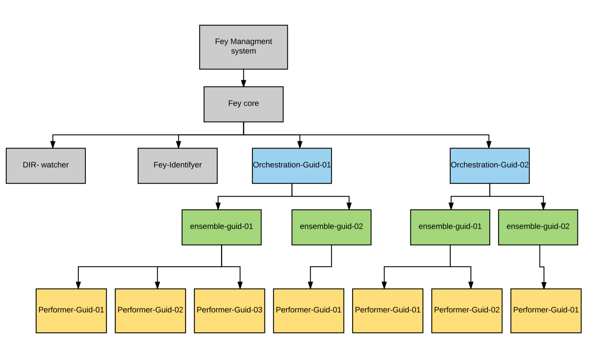
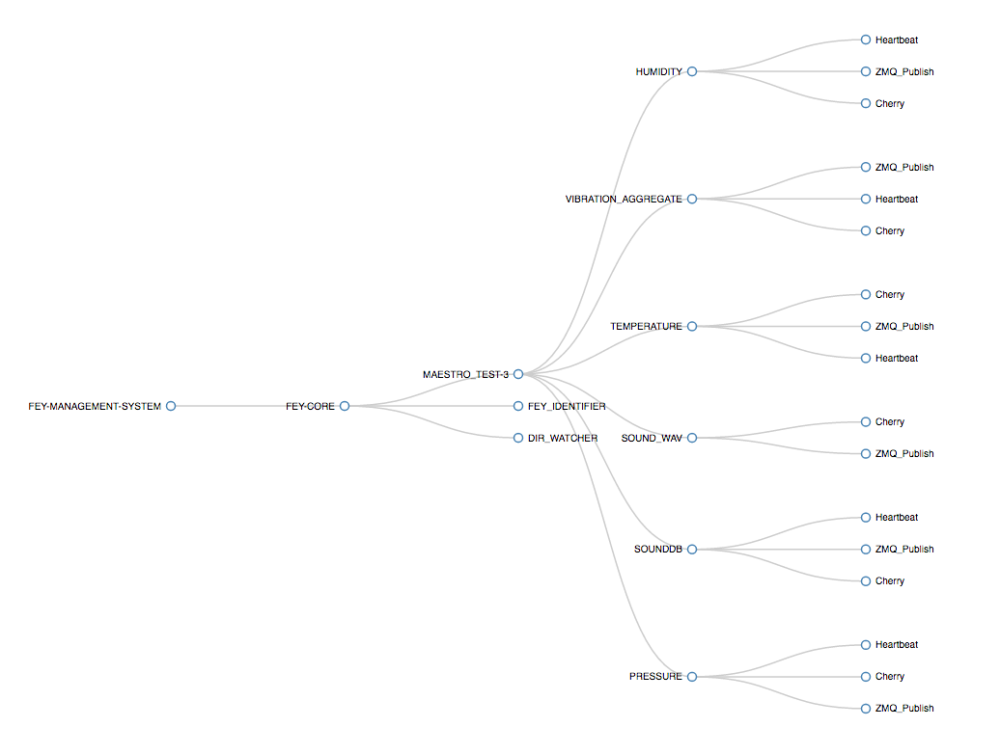

# Fey Engine

Fey is an [Akka](http://akka.io/) based framework that facilitates the definition of Fey actors each actor implementing a Fey component. 
Fey actors extend a generic Fey Actor _FeyGenericActor_ and override generic functions, like `onStart` and `execute` , to define an autonomous computation. 
Each Fey actor should be provided through a _.jar_ which the Fey engine loads to access the actors functionality.

The Actors defined by a set of _.jar_ files are referenced via a JSON configuration file that we call an **Orchestration**. 
The Orchestration is used to define which actors to use, what building properties of the actor to set, what unique parameters to pass into each actor, and what message passing relationship 
actors have with each other. In essence an Orchestration defines what will be computed by the Fey engine.
The _.jar_ files and the Orchestration files are stored in locations that the Fey Engine is told of , through its configuration, when it starts up. The Fey engine manages
the lifecycle of the actors, called **Performers**, defined by the Orchestrations. This includes the creation, execution, deletion, scalability and fault-tolerance of the component actors. 
An Orchestrations defines the message passing relationship that exists between actors as well as any time based scheduler to be implemented by each actor. 
Each Orchestration defines a computation to be executed by the Fey engine. Note each actor can specify, in the Orchestration file, that it wants Fey to automatically scale instances of an actor upwards or downwards 
based on the actors incoming message load. 

In summary the Fey engine manages Orchestrations of asynchronous networks of continuously operating actors that interact with each other through message passing. 
If you have a pre-defined set of _.jar_ files then programming the Fey engine is simply a matter of defining Orchestrations via JSON file. 
Orchestration files can be added, updated and deleted and the Fey engine will manage the Orchestration life cycle. 

The Fey engine can be used at different levels of compute infrastructure. For example it can run on low cost devices such as a _RaspberryPi_, on a standalone server or in a Mesos cluster. 
Remote invocation of actors make it possible for Orchestrations running in one location to interact with Orchestrations running in another where services not available locally can be accessed.

## Prerequisites

1. Java **SDK** (Software Development Kit) 1.8+
2. Scala 2.11
3. **SBT** 0.13.11 (<http://www.scala-sbt.org/>) 

## Architecture

Fey is composed by Akka actors. Following is the description of each one of the actors:

1. **Fey-Core**: Main actor of the system. It is the highest ancestor of all other actors and is created right after Fey started.
2. **Directory-Watcher**: Actor responsible for monitoring the JSON directory and notifying Fey-Core when a new file event happens.
3. **Fey-Identifier**: Actor responsible for sending the `Identity` message to each one of the active actors. _Routees_ are not affected by this actor.
4. **Orchestration-ID**: A new instance of Orchestration is created every time we process a JSON with a new Orchestration GUID. It is responsible for managing the Ensembles.
5. **Ensemble-ID**: A new instance of Ensemble is created under the correspondent Orchestration every time the JSON specify a new Ensemble GUID.
6. **Performer-ID**: A new instance is created for each Performer inside the Ensemble. Each Performer belongs to an Ensemble and also has a GUID.

The figure below shows the actor hierarchy for Fey. In this example, Fey has only two Orchestrations running, in which each Orchestration has two Ensembles, and each Ensemble has its own Performers.



Each actor path follows the following pattern:

* **Orchestration** - `/FEY-CORE/ORCHESTRATION-GUID/`
* **Ensemble** - `/FEY-CORE/ORCHESTRATION-GUID/ENSEMBLE-GUID/`
* **Performer** - `/FEY-CORE/ORCHESTRATION-GUID/ENSEMBLE-GUID/PERFORMER-GUID`

`Orchestrations manage their Ensembles and Ensembles manage their Performers`

When started Fey processes things in the following order: 
1. If checkpoint functionality is enabled it processes the JSON files in the checkpoint directory (see **[checkpointing](#markdown-header-fey-checkpoint)** below)
2. It processes JSON files in the Fey JSON repository directory 
3. Finally it starts monitoring for update and create events in the Fey JSON repository.

### Active Actors
 
Fey offers a REST-API end point that displays all active actors. 
It also uses the _Fey-Identifier_ actor that sends an `Identity` message to the actors. 
Having said that, some actors may take longer to answer back with their identity than others.
This can make it seem like those actor are not active becuase they are not present in the response.

The REST-API binds to `localhost` listening to the port `16666`, and the end point should be called with:
 
 ``` http://localhost:16666/fey/activeactors ```
 
 Below is a sample of what you might see:
 
 
 
## Running Fey

You can specify one argument in order to run Fey:

1. **Fey config file**: Path to the configuration file to be used by Fey. It is a _optional_ argument, if it is not defined then the default configuration will be used.

You just need to execute Fey _.jar_:
	
```java -jar fey.jar FEY_CONFIG_FILE```
	
Fey will process all the JSON files in JSON directory specified in the configuration file and then it will start monitoring that directory for file events.
**Note**: If checkpointing is enabled, then all files in the checkpoint directory will be processed before the ones in the JSON directory.

### Fey Configuration

The Fey configuration file can optionally include one of more of the following properties:

| Property                    | Type                 | Description   | Default|
| :---------------------- | :------------------- | :------------ | :------------ |
| **enable-checkpoint** | Boolean | Keeps track of the latest Orchestrations running in case Fey stops, it will restart Fey from the checkpoint. When checkpointing is enabled fey will add `.processed` to all processed files and start all Orchestrations in the checkpoint dir. If checkpointing is disabled then no checkpoint will be created. | true
| **checkpoint-directory** | String | Path where Fey should keep the checkpoint files | /tmp/fey/checkpoint |
| **json-repository** | String | Path that will be monitored by Fey in order to get the JSON files | ~/feyJSONRepo |
| **json-extension** | String | Extension of the files that should be processed by Fey | .json |
| **jar-repository** | String | Path where Fey should look for the GenericActor jars to be loaded from | ~/feyJarRepo |
| **log-level** | String | Log level for Fey | DEBUG|
| **log-appender**| String | Enable or disable the appender based on user configuration. Accepts 3 options: FILE or STDOUT or FILE_STDOUT | STDOUT |

### Fey Logging

Fey uses _logback.xml_ to configure its logs. By Default, Fey appends the to STOUT. You can change the configuration to log a file or you could log to both. 
If you ssave the log to a file the default location would be at `${HOME}/.fey/logs/`.
Fey uses a Rolling File Appender where each log file has a max size of one megabyte (1MB) and it keeps 30 log files at maximum.

In Fey the default log level is `DEBUG` for the entire system, and the other configuration offered by Fey are log level .

## JSON Configuration

Fey gets its instructions to start the generic actors through a well defined JSON schema. For Fey, each JSON will specify an Orchestration, in which will be defined the Ensembles with its Performers.

The Orchestration specification is defined at the root of the JSON, and requires the following JSON properties:

| Property                    | Type                 | Description   |
| :---------------------- | :------------------- | :------------ |
| **guid** | String | Global unique Orchestration identifier. If this property changes it value, it will be considered a new Orchestration by Fey.|
| **timestamp** | String | Orchestration timestamp. Holds the timestamp for the last action in the Orchestration.|
| **name** |String | Orchestration name.|
| **command** | String| See details in [Orchestration Commands](#markdown-header-orchestration-commands). | 
| **ensembles** | Array[Object] | Holds all the Ensembles that this Orchestration will be running. See [Ensembles](#markdown-header-ensembles) for more details| 

### Ensemble
An Orchestration can have one or more Ensembles. Each Ensemble must define the following properties:

| Property                    | Type                 | Description   |
| :---------------------- | :------------------- | :------------ |
| **guid** | String | Must be unique inside the Orchestration |
| **command** | String | See details in [Ensembles Commands](#markdown-header-ensemble-commands). |
| **performers** | Array[Object] | See details in [Ensemble Performers](#markdown-header-ensemble-performers). |
| **connections** | Array[Object] | See details in [Ensemble Connections](#markdown-header-ensemble-connections). |

###Orchestration Commands
Fey drives the Orchestration based on a set of 4 commands:

1. `CREATE`: Fey will check if there is an Orchestration with the same _guid_ running. If there isn't, Fey will create the Orchestration, the Ensembles and its Performers, and start them. If there is already an Orchestration running, Fey will log an WARN, and nothing will be created or updated. 
2. `UPDATE`: Fey will check if there is already an Orchestration with the same _guid_ running. If there is, Fey will check the command for each one of the Ensembles and execute the respective action. If there isn't, Fey will log an WARN, and nothing will happen. Please, see [Ensemble Commands](#markdown-header-ensemble-commands) for a list of available commands.
3. `DELETE`: If there is an Orchestration with the same _guid_ running, Fey will stop all of the actors and delete the Orchestration.
4. `RECREATE`: The recreate commands does not care if the Orchestration exists or not, it will always try to delete the Orchestration and then create a new one based on the JSON specification.

###Ensemble Commands

If the Orchestration command is `UPDATE`, Fey will check if the Orchestration is running and then for each one of the Ensembles it will check the specific command:

1. `CREATE`: Creates a new Ensemble if there isn't one running yet.
2. `UPDATE`: Deletes the Ensemble and starts a new one using the new configuration.
3. `DELETE`: Deletes the Ensemble.
4. `NONE`: The Ensemble will not change.

### Ensemble Performers

For Fey, each Performer represents a Generic Actor which should have the following properties:

| Property                    | Type                 | Description   |
| :---------------------- | :------------------- | :------------ |
| **guid** | String | Must be a unique ID inside the Ensemble |
| **controlAware** | Boolean | `Optional` property. Tells if the actor should use a Control aware Mailbox, so the Control messages have higher priority over the others. If not specified then the actor will use the Default mailbox.
| **autoScale** | Integer | `Optional` property. Tells if the actor should be a load balanced actor. If zero or not specified, the actor will be started without the load balancing property. If greater than zero, the actor will be started using load balancing and the max number of replicated actors is the specified number. It means that if the value is 10, then the actor will be a load balanced actor and it can scale up to 10 replicas. |
| **schedule** | Integer | Defines the time interval in `Milliseconds` for the actor [scheduler](#markdown-header-scheduler). If zero, no scheduler will be started. |
| **backoff** | Integer | Defines the time window in `Milliseconds` that the actor should backoff after receiving a PROCESS message. (See [Handling Backoff](#markdown-header-handling-backoff) for more details.) |
| **source** | Object | Defines the needed information used by Fey to load the GenericActor. See [Source](#markdown-header-source-property) for details.

#### Source Property

The source property of an Performer holds the necessary information for loading the actor from a _.jar_. Each Performer has only one source property and it should contains the following information:

| Property                    | Type                 | Description   |
| :---------------------- | :------------------- | :------------ |
| **name** | String | Jar name that contains the Generic Actor. This jar must be present in the specified [jar repo](#markdown-header-running-Fey). The jar name is not case sensitive. |
| **classPath** | String | class path for the GenericActor class inside the _.jar_. It should include the package as well.|
| **parameters** | Object | Contains any additional information that will be used by the GenericActor. It will be passed to the actor as a `HashMap[String,String]` in which the key is the property name, and the value is the property value. It can contain as many properties as you want to.|

### Ensemble Connections
The Connections property of an Ensemble defines the connection between the Performers. See [connectTo](#markdown-header-constructor) constructor parameter for more details about how this information is used.

An object inside the Connections property obeys the following pattern:

1. Property name: Performer GUID that will be connect to the property values.
2. Property value: Array of Performer IDs that will be connected to the property name.

`The Performer IDs must be defined at the Performer property of the Ensemble in order to be used inside the Connections`

### Sample JSON

This JSON specifies an Orchestration that has only one Ensemble. The Ensemble defines the Redis and ZMQ _.jar_ and then maps the Redis Permer's output messages to
to the ZMQ Performer.

```json
{  
  "guid":"MYORCHESTRATION01",
  "command":"CREATE",
  "timestamp":"213263914535",
  "name":"ORCHESTRATION SAMPLE JSON CONFIG",
  "ensembles":[  
    {  
      "guid":"ENSEMBLE01",
      "command":"NONE",
      "performers":[  
        {  
          "guid":"REDIS",
          "schedule":1000,
          "backoff":0,
          "source":{  
            "name":"fey-redis.jar",
            "classPath":"com.fey.RedisConnector",
            "parameters":{  
              "server":"localhost",
              "keys":"{\"keys\":[\"key1\",\"key2\"]}",
              "port":"1234"
            }
          }
        },
        {  
          "guid":"ZMQ",
          "schedule":0,
          "loadBalance":3,
          "backoff":0,
          "source":{  
            "name":"fey-zmq.jar",
            "classPath":"com.fey.ZMQPublisher",
            "parameters":{  
              "server":"localhost",
              "topic":"mytopic",
              "port":"1235"
            }
          }
        }
      ],
      "connections":[  
        {  
          "REDIS":[  
            "ZMQ"
          ]
        }
      ]
    }
  ]
}
```
## Fey Checkpoint

Fey will keep track of the latest version of each Orchestration running. This can be disabled through the configuration file.
When checkpoint is enabled, Fey will process the files in the JSON directory and for each it will add a file extension
that refects its status:

1. `.processed`: Means that the file had the correct JSON schema and was able to be processed by Fey.
2. `.failed`: Means that something was wrong in the JSON and it could not be parsed by Fey.

All running Orchestration have their JSON file stored in the checkpoint directory.  If the Fey system restarts, 
Fey will restart all Orchestrations in the checkpoint directory prior to starting new ones that have appeared in the JSON directory.

If checkpoint is not enabled no extension will be added to the JSON files and no checkpoint will be kept. This option is useful for the developers of Fey performers when in
development mode.

## Developing New Performers 

All actors (called **Performers** in Fey) used by Fey `must be` an extension of the `FeyGenericActor` abstract class. In order to create your own _Fey Generic Actor_ you will need to add fey as a `provided` library to your project and create a new class that extends from _FeyGenericActor_.

###Constructor

The Generic Actor offers the following constructor parameters:

| Name                    | Type                 | Description   |
| :---------------------- | :------------------- | :------------ |
| params                  | Map[String,String]   | Holds all the extra configuration that is going to be used by the actor. For example: ("port" -> "1234") |
| backoff                 | FiniteDuration       | Time interval to backoff after the processing of the message PROCESS. Will always be greater or equal to zero |
| connectTo               | Map[String,ActorRef] | Holds all the actors that your actor is suppose to propagate a message to. Maps the Actor's ID to the ActorRef
| schedulerTimeInterval   | FiniteDuration       | Time interval for the scheduler. If it is zero, then no scheduler will be started for the actor.
| orchestrationName             | String               | Name of the Orchestration in which the actor belongs to 
| orchestrationID               | String               | Id of the Orchestration in which the actor belongs to
| autoScale | Boolean | True means that this actor will be replicated in order to obtain scalability, so you should be ware that the `onStart` will be called for each replica.

When starting a new **Performer**, Fey will give to the actor all the configuration specified in the Orchestration's JSON.

`The GenericActor must override all the constructor parameters in order and can not define any extras one.`

The reason for these restrictions is that Fey will load your actor from the _.jar_ and you generate the actor reference passing in the list of constructor parameters in order. In case these restrictions are not obeyed, Fey will throw an _IllegalArgumentException_ exception during the creation of the actor because it could not find a matching constructor on the class.

```scala
class MyGenericActor(override val params: Map[String, String] = Map.empty,
               override val backoff: FiniteDuration = 1.minutes,
               override val connectTo: Map[String, ActorRef] = Map.empty,
               override val schedulerTimeInterval: FiniteDuration = 30.seconds,
               override val orchestrationName: String = "",
               override val orchestrationID: String = "",
               override val autoScale: Boolean = false) extends FeyGenericActor {}
```

### Life-cycle Actor Hooks

Fey's generic actor final overrides the life-cycle actor hooks, such as: `preStart`, `postStop`, `preRestart`, `postRestart`. But, it does offers the user the ability to execute additional commands by overriding the following methods:

* **onStart**: Will be called as part of the actor's life-cycle `preStart`, right after make the decision of starting a scheduler or not (see **[Scheduler](#markdown-header-scheduler)** for more details). Be careful when using this method for an autoscaling Performer, since it will be called for every routee (Akka terminology). So, if you are doing something like binding to a port in the OnStart method of the Performer, other routees may not be able to bind to the same port again. (See **[Auto Scaling](#markdown-header-auto-scaling)** for more details)
* **onStop**: Will be called as part of the actor's life-cycle `postStop`, after stopping the scheduler. Normally, this method is used to "clean-up" the actor, like closing connections.
* **onRestart**: Will be called as part of the actor's life-cycle `postRestart`. When the actor is restarted, all of its children will be stopped and the `postStop` is going to be called, followed by calling `preStart`

### Messages

Fey's generic actor final overrides the actor's `receive` method. But it gives you a complementary receive that is going to be called in case the message could not be handled by the generic receiver. The generic actor handles the following messages:

1. **PRINT-PATH**: logs the actor's path
2. **STOP**: Stops himself
3. **PROCESS(message: T)**: Generic typed message that should be used for the communication between generic actors. This message check if the backoff is enable, and if not, it calls the user-overridable _processMessage_ method. (See **[processing messages](#markdown-header-processing-messages)** for more details). 
4. **EXCEPTION(reason: Throwable)**: Throws the _Throwable_ so the actor's parent can handle it.

All of the other messages that are not handled by the default _receive_ will be pass to the user-overridable **customReceive: Receive** method.

`Keep in mind that even if your actor can handle a different set of messages of the default ones, the main communication between the generic actor should happen through the PROCESS message`

###Propagating Messages

Fey works with the concept that the actor will communicate with the actors that connects to it by sending _PROCESS_ messages. Having that in mind, the generic actor offers a final generic typed method (`propagateMessage(message:T)`) that sends a _PROCESS_ message to each one of the actors in the **[connectTo](#markdown-header-constructor)** parameter.

`If you don't want to propagate the message to all of the actors that connects to it, you should implement a different propagate method.`

###Processing Messages

The `PROCESS[T](message: T)` is the global message to be used when communicating to other Fey actors. The actor can receive any type of message through it. 

After receiving the `PROCESS` message, the actor will check if the [backoff](#markdown-header-handling-backoff) is enabled and, if it is enabled, nothing will happen and the message will not be processed, if it is not enabled then the actor will call the user-overridable `processMessage[T](message: T, sender: ActorRef)` method.

The default implementation of `processMessage[T](message: T, sender: ActorRef)` logs the message being processed, calls the [propagate](#markdown-header-propagating-messages) method and then starts the backoff by calling `startBackoff` method (see [Handling Backoff](#markdown-header-handling-backoff)).

You could override this method to handle only the type of message that you are expecting and to execute some action when a message is received. In the example bellow, the actors only handles PROCESS message of type `Int` or `String`, and starts the backoff if the message is of type `Int`

```scala
override def processMessage[T](message:T, sender: ActorRef): Unit = {
 message match {
   case msg:String =>
     log.info(s"Processing String $msg")
   case msg:Int =>
     log.info(s"Processing Int $msg -> ${msg+1}")
     startBackoff()
   case x => log.info("Type not handled")
 }
}
```

####Handling Backoff

A lot of use cases will require the Performer (actor) stop processing messages for a time interval after some specific action happend. The generic actor offers a built-in backoff that is used only by the `PROCESS` message.

Every time you need the actor to backoff after an action, you should call the `startBackoff` method.
The `startBackoff` method uses the constructor parameter **[backoff](#markdown-header-constructor)** and sets an internal state of the actor called `endBackoff` with the time in which the actor should starting processing messages again.
The `endBackoff` internal state is verified everytime the actor gets a **[PROCESS](#markdown-header-processing-messages)** message.

`Note: Be careful when calling startBackoff. Make sure it will just be affected by the flow around the PROCESS message`


###Scheduler

The generic actor is able to start and control one scheduler. The scheduler will be started through the `preStart` life-cycle hook that will check if the constructor parameter **[schedulerTimeInterval](#markdown-header-constructor)** is non-zero then Fey starts a `system.scheduler` that executes every **[schedulerTimeInterval](#markdown-header-constructor)**. If the parameter is zero no scheduler will be started.

Once started, the scheduler will call the user-overridable `execute()` method every schedulerTimeInterval. If the actor dies or get restarted, the scheduler will be cancelled and then started again (in case of restart).

`Note: You can start as many schedulers as you want to inside your generic actor, but just the one started during the creation of the actor by Fey will be monitored, i.e., will be stopped and started as necessary.`

### Auto Scaling

Fey implements [Akka](http://akka.io/) Load Balacing functionality (we call this Autoscaling) using [Router Actors](http://doc.akka.io/docs/akka/snapshot/scala/routing.html) with **SmallestMailboxPool** strategy and with **DefaultResizer**. When starting the actor, Fey looks to the JSON configuration and checks if the Performer should is an auto scaled Performer. For more information about Routers, please visit Akka's webpage.
 
### Example of a Fey Generic Actor

```scala
class MyGenericActor(override val params: Map[String, String] = Map.empty,
               override val backoff: FiniteDuration = 1.minutes,
               override val connectTo: Map[String, ActorRef] = Map.empty,
               override val schedulerTimeInterval: FiniteDuration = 30.seconds,
               override val orchestrationName: String = "",
               override val orchestrationID: String = "",
               override val autoScale: Boolean = false) extends FeyGenericActor {

  override def onStart() = {
    log.info(s"STARTING ${self.path.name}")
    val ZMQcontext = ZMQ.context(1)
    val publisher = ZMQcontext.socket(ZMQ.PUB)
    publisher.bind(s"tcp://localhost:${params.get("port").get}")
  }

  var count = 0
  
  override def execute() = {
    count +=1
    propagateMessage(count)
  }

   override def processMessage[T](message:T, sender: ActorRef): Unit = {
     message match {
       case msg:String =>
         log.info(s"Processing String $msg")
       case msg:Int =>
         log.info(s"Processing Int $msg -> ${msg+1}")
         startBackoff()
       case x => log.info("Type not handled")
     }
   }


  override def customReceive(): Receive ={
    case x => log.warning(s"Untreated message $x")
  }

}
```